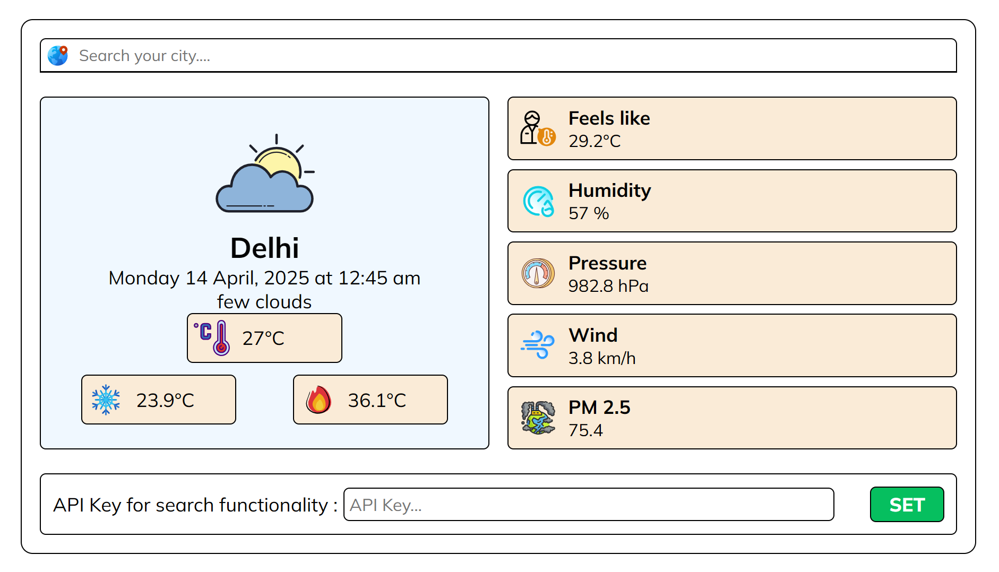

Here's a clean and complete `README.md` you can include in your GitHub repository to document and give proper credit for your weather and city search app.

---

## 🌤️ Weather Search App

This is a simple and elegant weather search application that allows users to:

- 🌍 Search for a city using live suggestions.
- ⛅ View current weather conditions like temperature, wind, humidity, pressure, and forecast.
- 🏭 Check PM2.5 air quality levels.
- 🌐 Automatically fetch weather based on latitude and longitude of selected cities.

---

### 🚀 Live Features

- **City Autocomplete Search** powered by the GeoDB Cities API
- **Real-time Weather Data** via Open-Meteo API
- **Air Quality Index (PM2.5)** via Open-Meteo AQI API
- User-friendly UI built with HTML, CSS, and vanilla JavaScript
- Custom icons and minimal aesthetic for clean experience

---

### 📸 Screenshot

**

---

### 🛠️ How to Use

1. Clone this repository:
   ```bash
   git clone https://github.com/mayank-0103/Weather-using-API.git
   cd Weather-using-API
   ```

2. Open `index.html` in any browser.

3. Add your API key in the input field at the bottom and click **SET**.

---

### 🔐 API Keys

To use this project, you need a **free API key** from [RapidAPI for GeoDB Cities](https://rapidapi.com/wirefreethought/api/geodb-cities/).

---

### 💡 APIs Used

| API Name              | Description                                   | Credit & Link                                                                 |
|-----------------------|-----------------------------------------------|--------------------------------------------------------------------------------|
| 🌍 GeoDB Cities API   | Autocomplete and location info for cities     | [wirefreethought on RapidAPI](https://rapidapi.com/wirefreethought/api/geodb-cities/) |
| 🌦 Open-Meteo API     | Weather forecast and current data             | [Open-Meteo](https://open-meteo.com/en/docs)                                  |
| 🏭 Open-Meteo AQI API | Air quality (PM2.5) data                      | [Open-Meteo Air Quality API](https://open-meteo.com/en/docs/air-quality-api)  |

---

### 🧑‍💻 Files Included

- `index.html` – UI Layout
- `style.css` – Responsive styles
- `app.js` – Core JavaScript logic for weather & API integration
- `icons/` – Folder for weather icons

---

### 📌 Note

- This project does not store or expose API keys publicly.
- You must **enter your own API key** into the app at runtime via the UI input field.

---

### 🙏 Acknowledgements

Special thanks to:
- [GeoDB Cities API](https://rapidapi.com/wirefreethought/api/geodb-cities/)
- [Open-Meteo](https://open-meteo.com)
- [Font Awesome](https://fontawesome.com) & [Icons8](https://icons8.com/) for icons
- All open-source communities who make free data and APIs available

---

### 📄 License

This project is licensed under the [MIT License](LICENSE).

---